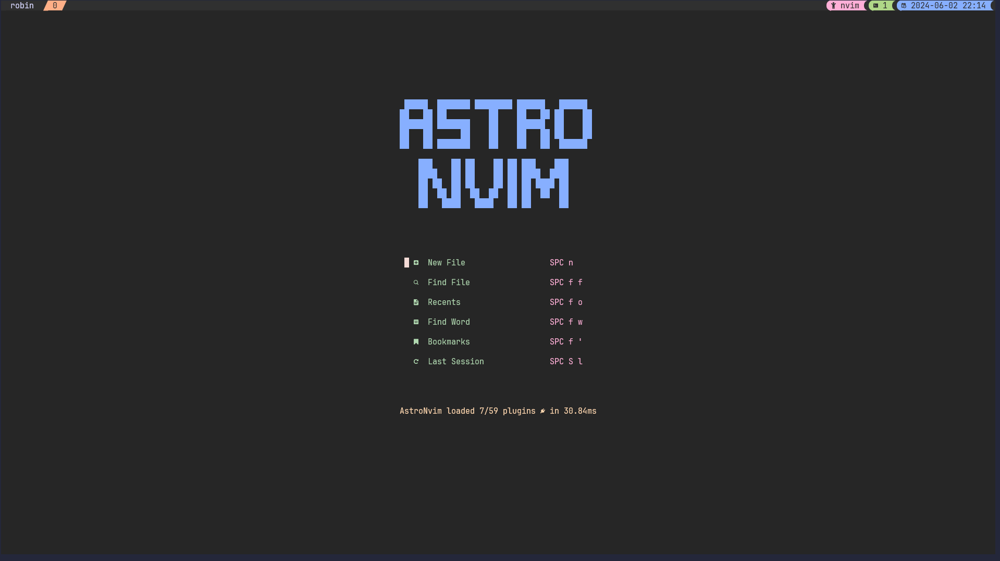

# Setup

My Setup is optimized for Windows Terminal with WSL 2 (Ubuntu 22.04.03 LTS) with `JetBrainsMono Nerd Font Mono`.
For this configuration to work you need to have homebrew (brew) and oh-my-zsh installed.

## CLI Programms

| Programm | Description                                                                                                                                                                                                                                  |
| -------- | -------------------------------------------------------------------------------------------------------------------------------------------------------------------------------------------------------------------------------------------- |
| starship | A customizable and minimalistic prompt for any shell, designed to provide useful information at a glance. It is fast, feature-rich, and supports various configurations to suit your workflow.                                               |
| lazygit  | A simple terminal UI for Git commands, making it easier to manage Git repositories with a visual interface. It streamlines common Git operations like staging, committing, and merging with intuitive keyboard shortcuts.                    |
| ripgrep  | A faster version of the command line Tool grep.                                                                                                                                                                                              |
| fzf      | A command-line fuzzy finder that helps you quickly and efficiently search and filter files, directories, and other data from the command line. It can be used to enhance various command-line workflows and tools.                           |
| fd       | A simple, fast, and user-friendly alternative to the traditional find command. It is designed to offer improved performance and usability, with sensible defaults and intuitive syntax.                                                      |
| bat      | A cat clone with syntax highlighting and Git integration, making it easier to read source code and text files in the terminal. It also provides line numbers and file headers for better context.                                            |
| eza      | A modern replacement for the ls command with improved aesthetics and functionality. It offers features like file icons, Git status integration, and better formatting options.                                                               |
| zoxide   | A smarter cd command that helps you navigate your filesystem quickly by keeping track of your most used directories. It learns your usage patterns and enables fast directory jumping with minimal typing.                                   |
| k9s      | A terminal-based UI to interact with your Kubernetes clusters, making it easier to manage and troubleshoot your containerized applications. It provides real-time insights, log access, and resource management with an intuitive interface. |
| kubecm   | A tool for managing multiple Kubernetes configs with ease, allowing you to quickly switch between different clusters and namespaces.                                                                                                         |
| git-delt | A tool for displaying better git-diffs in the CLI.                                                                                                                                                                                           |

### Installation

```bash
brew install fzf fd bat eza zoxide k9s kubecm lazygit ripgrep git-delt
```

```bash
# Starship
curl -sS https://starship.rs/install.sh | sh
# git FZF integration
git clone https://github.com/junegunn/fzf-git.sh.git ~/fzf-git/
```

I use the catppuccin macchiato theme for bat. If you want to use it too you need to execute the following commands. Otherwise remove the line `export BAT_THEME="Catppuccin Macchiato"` in the `.zshrc` file.

```bash
wget -P "$(bat --config-dir)/themes" https://github.com/catppuccin/bat/raw/main/themes/Catppuccin%20Macchiato.tmTheme && \
bat cache --build
```

I also use syntax highlighting in my cli to active this run the following command. But if not remove this line from the zshrc file `source /home/robin/zsh-syntax-highlighting/zsh-syntax-highlighting.zsh`.

```bash
git clone https://github.com/zsh-users/zsh-syntax-highlighting.git ~/.oh-my-zsh/custom/plugins/zsh-syntax-highlighting/
```

### Git delta configuration

To configure a better git diff add this to your `~/gitconfig`.

```bash
[core]
    pager = delta

[interactive]
    diffFilter = delta --color-only

[delta]
    navigate = true
    # side-by-side = true

[merge]
    conflictstyle = diff3

[diff]
    colorMoved = default
```

### Kubecm configuration

Move all your kubeconfigs into a folder like `~/kubeconfigs/`. And add the Folder to the Kubecm context.

```bash
kubecm add ~/kubeconfigs/
```

To select a kubeconfig just type `kubecm switch` or `kubecm s` in your CLI to switch the context.

### Tmux plugin manager (TPM) setup

Clone the git repo

```bash
git clone https://github.com/tmux-plugins/tpm ~/.tmux/plugins/tpm
```

Add this to your tmux config usually found under `~/.tmux.conf`

```bash
# List of plugins
set -g @plugin 'tmux-plugins/tpm'
set -g @plugin 'tmux-plugins/tmux-sensible'


# Initialize TMUX plugin manager (keep this line at the very bottom of tmux.conf)
run '~/.tmux/plugins/tpm/tpm'
```

To load TPM execute `tmux source ~/.tmux.conf` and press `prefix` + `I` to install all dependencies.

I also rebound the tmux prefix to `CTRL+a` instead of `CTRL+b`. To do that add this to the top of your tmux conf.

```bash
# Rebind Prefix
set -g prefix C-a
```

Here i also use a catppuccin theme for the status bar.

To install this you need the following lines to your tmux config.

```bash
set -g @plugin 'catppuccin/tmux'

# Theme settings
set -g @catppuccin_flavour 'macchiato'

set -g @catppuccin_window_left_separator "█"
set -g @catppuccin_window_right_separator "█ "
set -g @catppuccin_window_number_position "right"
set -g @catppuccin_window_middle_separator "  █"

set -g @catppuccin_window_default_fill "number"

set -g @catppuccin_window_current_fill "number"

set -g @catppuccin_status_modules_right "application session date_time"
set -g @catppuccin_status_left_separator  ""
set -g @catppuccin_status_right_separator " "
set -g @catppuccin_status_right_separator_inverse "yes"
set -g @catppuccin_status_fill "all"
set -g @catppuccin_status_connect_separator "no"
set -g status-left-length 100
```

## NEOVIM

This installation is for neovim version >= v0.10.0.

My Neovim configuration uses Astrovim ([docs](https://docs.astronvim.com/)) as the base. Here i also use the catppuccin macchiato theme. And some small key mapping changes.  
To use the configuration clone the nvim directory from this repository into `~/.config/` and run nvim to install all the dependencies. But if you want to use the native installation run the following commands.

```bash
git clone --depth 1 https://github.com/AstroNvim/template ~/.config/nvim
rm -rf ~/.config/nvim/.git
nvim
```

For Astrovim to work properly you need to have a [NerdFont](https://www.nerdfonts.com/) installed.

To install Language Server support (LSP) for programming languages it uses Mason. To install a LSP open neovim and type `:MasonInstall LSPNAME` or `:Mason` to install it via a GUI.

Some useful Hotkeys:

-   `<leader>` == spacebar
-   `<leader>+gg` -> opens lazygit
-   `<leader>+ff` -> search for file
-   `<leader>+fw` -> search for text in files
-   `<leader>+tf` -> open a floating terminal window
-   `CTRL+l` -> hide the floating terminal window
-   `<leader>+/` -> toggle comment for a line
-   `<leader>+w` -> save the current file
-   `<leader>+q` -> quit vim
-   `<leader>+c` -> close current buffer
-   `<leader>+e` -> toggle file explorer
